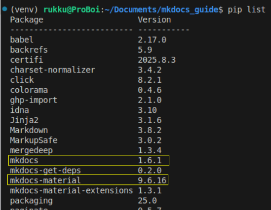

# Part 3: Installing MkDocs and Material for MkDocs

In this part, you'll create a **virtual environment** to manage project dependencies and install MkDocs along with the Material for MkDocs theme.

??? question "Why use a virtual environment?"
    It helps **isolate your project’s Python dependencies** from other projects and system-wide packages, keeping things **clean** and **manageable**.

        
---

## 1. Open the Integrated Terminal in VS Code

You can open the terminal inside VS Code in two ways:

1. Use the shortcut: ``` Ctrl + ` ```
2. Or navigate to the menu: Terminal > New Terminal

>This terminal will open in the context of your project folder, so any virtual environment or installation stays within this directory.

## 2. Create and Activate a Virtual Environment

Next, you will create a new virtual environment named `venv` that contains the isolated Python environment and activate it.

```bash
# Create a new virtual environment named 'venv'.
python3 -m venv venv

# Activate the virtual environment.
source venv/bin/activate
```
>You'll know the virtual environment is active when you see ` (venv) ` at the beginning of your terminal prompt.

## 3. Install MkDocs and the Material Theme

With your virtual environment active, install the necessary packages using `pip`.

```bash
# Installs MkDocs and the Material for MkDocs theme.
pip install mkdocs mkdocs-material
```


## 4. Verify the Installation

After the installation is complete, confirm that both packages are present in your environment.

```bash
# Lists all packages installed in the virtual environment.
pip list

```
>You should see both **mkdocs** and **mkdocs-material** listed in the output like this:



You have now successfully installed MkDocs and its theme. You're ready to create your first documentation project.

---

⬅️ **Previous:** [Create Project Directory](part2.md) &nbsp;&nbsp;&nbsp;&nbsp;&nbsp; 
➡️ **Next:** [Create and Configure the Project](part4.md)


