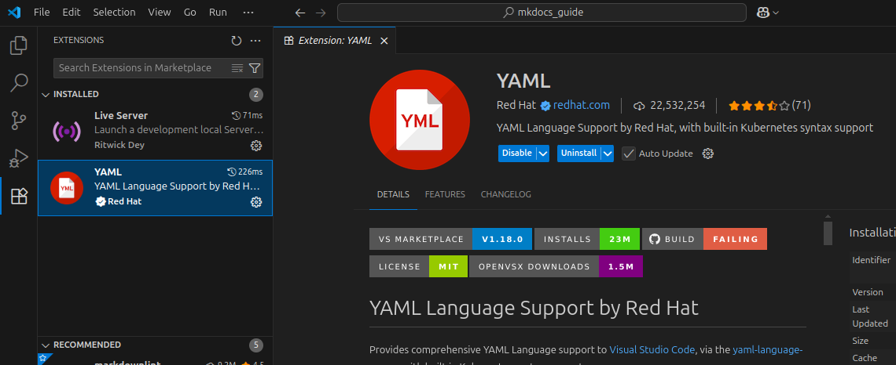
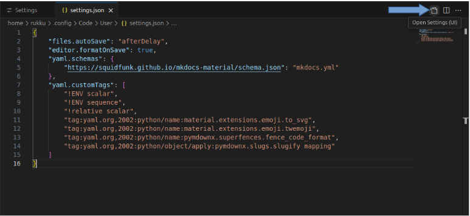

# Part 4: Create and Configure the Project

In this section, you will generate your MkDocs project files and configure the core settings that control how your documentation site looks and behaves.

---

## 1. Create a New MkDocs Project

With your virtual environment activated, run:

```bash 
# Creates a new MkDocs project in the current directory.  
mkdocs new .
```

## 2. Understand the `mkdocs.yml` File and Project Structure

After running `mkdocs new .` , two important components are created in your project directory:

    mkdocs.yml    # The configuration file.
    docs/
        index.md  # The documentation homepage.
        ...       # Other markdown pages, images and other files.

Here's what each of them does:

 * **docs/**: This folder contains your Markdown files. By default, it starts with an **index.md**, which is the homepage of your documentation site.
 * **index.md**: A sample Markdown file where you can begin writing your content. MkDocs converts this into the **homepage** of your site.
 * **mkdocs.yml**: This is the main **configuration file** for your MkDocs project. You'll use it to:
    * Set your site name
    * Define navigation structure
    * Choose and configure the theme
    * Add plugins, extensions, and custom settings , etc.


## 3. Install the YAML Language Support Extension

To enable syntax validation and auto-completion for your mkdocs.yml file, install the **YAML Language Support by Red Hat** extension in VS Code.

 1. Open the Extensions view by clicking the Extensions icon on the Activity Bar or by pressing `Ctrl+Shift+X`.
 2. Search for *YAML*.
 3. Select the **YAML Language Support by Red Hat** extension and click Install. 
 >
 

## 4. Enable Schema Validation

Once the extension is installed, you can link MkDocs to the YAML schema for better linting support.

To do this:

 1. Open `settings.json` by clicking the **:octicons-gear-24:** **gear icon** in the bottom left. 
 2. Next, click the  :material-file-document-outline: **document icon** in the top right.
 >>
 
 3. Add the following at the bottom of the `settings.json` file:
```json title="settings.json"
{
  "yaml.schemas": {
    "https://squidfunk.github.io/mkdocs-material/schema.json": "mkdocs.yml"
  },
  "yaml.customTags": [ 
    "!ENV scalar",
    "!ENV sequence",
    "!relative scalar",
    "tag:yaml.org,2002:python/name:material.extensions.emoji.to_svg",
    "tag:yaml.org,2002:python/name:material.extensions.emoji.twemoji",
    "tag:yaml.org,2002:python/name:pymdownx.superfences.fence_code_format",
    "tag:yaml.org,2002:python/object/apply:pymdownx.slugs.slugify mapping"
  ]
}
```
## 5. Configure the MkDocs Project

Open the newly created `mkdocs.yml` file in VS Code. 

Add the following basic `mkdocs.yml` configuration:
```yaml
site_name: My MkDocs Material Documentation
site_url: https://sitename.example
theme:
  name: material
```

!!! warning 

    The `site_url` setting is important because by default, MkDocs assumes your site is at the root of your domain. This is often not the case, especially when using GitHub Pages without a custom domain. For this reason, and because some plugins require it, it's a best practice to always set the `site_url`.


## 6. Run the Site Locally

Run the following command to launch a local development server, so you can preview your documentation site in your browser.

```bash
mkdocs serve

```
>This command starts a local development server (usually at **http://127.0.0.1:8000**). 

>To view your site, `Ctrl+Click` the **link** in your terminal or copy and paste it into your browser—it updates automatically as you make changes.


!!! tip "Tips for Your Workflow" 

    * **Stop the server** : To stop the server at any time, press `Ctrl+C` in the terminal.
    * **Deactivate the virtual environment**: When you are done with your work, deactivate the virtual environment by simply running deactivate.
    * **Reactivate later**: When you return to your project, navigate to the project directory and reactivate the environment with `source venv/bin/activate`.


## 7. Basic Customization
Your new site is now up and running with the Material for MkDocs theme. You can begin customizing your project by modifying the `mkdocs.yml` file. 

For advanced configuration options and detailed customization, you can refer to the [Material for MkDocs official documentation](https://squidfunk.github.io/mkdocs-material/setup/).


With your project structure and configuration now in place, you are ready to move on to the next section and publish your site using GitHub Pages.

---

⬅️ **Previous:** [Installing MkDocs and Material for MkDocs](part3.md) &nbsp;&nbsp;&nbsp;&nbsp; ➡️ **Next:** [Deploying the Site with GitHub Actions](part5.md)

